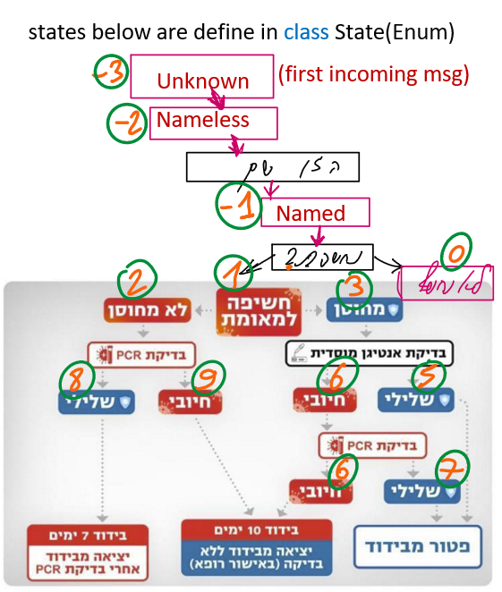

# PythonSimpleBot
minimal barebones telegram bot for teaching purposes

When creating the bot you'll have to create an .env file (mind the dot).

Put your key in the .env file as following:

API_KEY = 17171717171:YOUR_KEY_YOUR_KEY_etc

An alternative for windows is to set API_KEY as a system variable, and restart your computer.

The code is intended to manage the following states:
